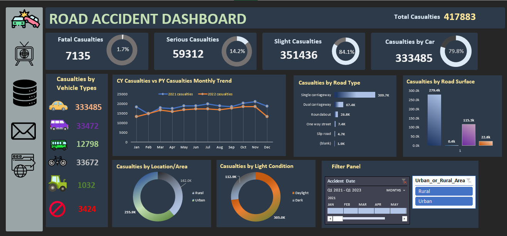
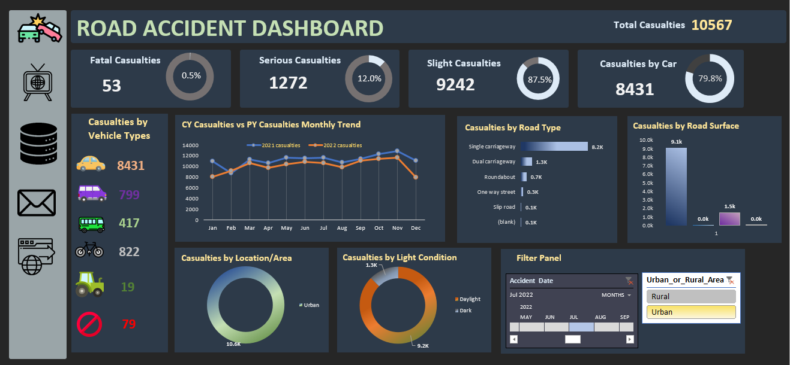

# Road-Accident-Dashboard
This project is an interactive Excel dashboard created to analyze road accident data and generate meaningful insights.

The dashboard helps understand accident trends, casualties, and factors affecting road accidents.

## Tools Used
- Microsoft Excel
- Pivot Tables
- Pivot Charts
- Slicers
- Data Cleaning

## Dashboard Features
- Total accidents and casualties summary
- Monthly accident trend analysis
- Vehicle type analysis
- Road condition analysis
- Interactive filters using slicers

## Dataset
The dataset contains information about road accidents including:
- Location
- Date
- Vehicle Type
- Casualties
- Road Conditions

  Full Dataset not uploaded due to large size.

## Project Files
- Excel Dashboard File (.xlsx)
- Dataset
- Dashboard Screenshot

## Dashboard Preview

### Main Dashboard

### Data Analysis Sheet (Pivot Tables)

### Dashboard with Filters Applied

### Filter Panel

## Author
Ishika
